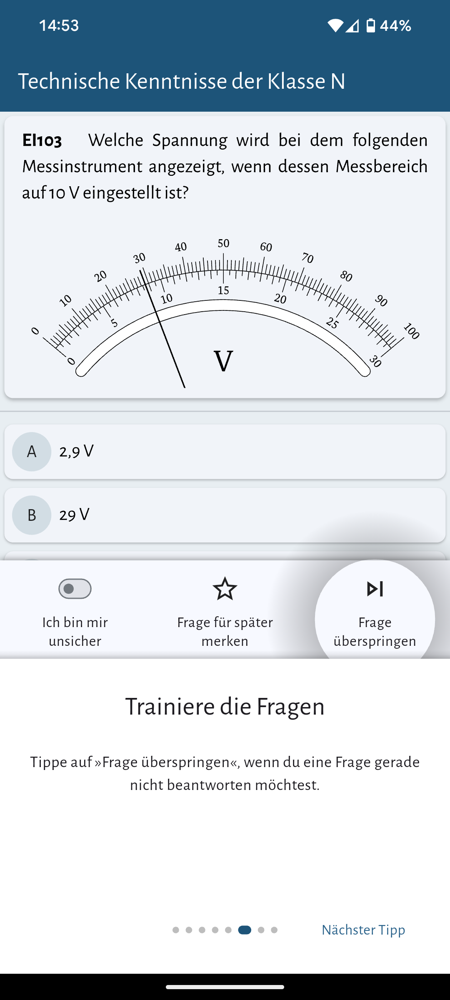

# Hamfisted

 

 

Mit dieser App kannst du dich auf die Amateurfunkprüfung für die Klassen E und A vorbereiten. Übe alle Fragen der offiziellen Fragenkataloge der Bundesnetzagentur für die Teile "Technik Klasse E", "Technik Klasse A", "Betriebstechnik" sowie "Vorschriften" und behalte den Überblick über deinen Fortschritt.

 
 
 

 
 
 

 

 
